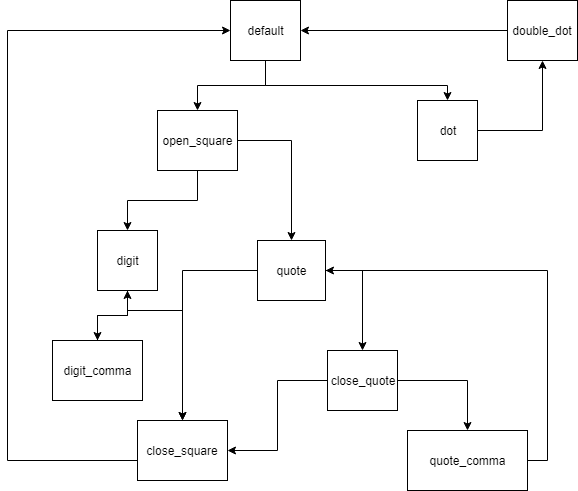

# Scala Json Path

## A scala implementation of the json path DSL

### Getting started
JsonPath expression support both the dot notation and the bracket notation for accessing JSON objects

`$.store.title`

`$['store']['title']`

### Operators
|operator|Description|
|---|---|
|$|Get the root element (not currently supported)|
|@|Get the current element (not currently supported)|
|.path|get child element|
|['child']|get the child element|
|[n]|get the nth element in an array (e.g. $.books[5])|
|['path1', 'path2']| get the path1 and path2 child elements|
|[0,5]| get the 0th and 5th elements of the array|
|`[start:end:step]`|get a slice of the array|
|..|Deep scan. Get ALL decendants of the object/array|
|*|Wildcard. Get all children of the object/array| 

### How to use
```text
val jsonPath = new JsonPath(jsonPath: String)
jsonPath(JSONObject)/jsonPath(JSONArray)/jsonPath(jsonObject: String) -> returns jsonPath traversal of input json object
``` 

## How it works
The initial implementation (and the current implementation) just supports walking the object

### V0.1
It was broken up into two components 
1. A parser
1. A group of classes that construct an AST (Actually an Abstract Syntax List, since there were no branches). There were two classes -> JsonObjectPath and JsonArrayPath

The parser was really simple. It split the expression on . (dot) characters.
It would then switch on whether the character was numeric or a string and then output the JsonObjectPath/JsonArrayPath

For example: 
`"key.0.value"` would get split into `("key", "0", "value")`
This list would then get translated into `(JsonObjectPath("key"), JsonArrayPath(0), JsonObjectPath("value"))`

The PathComponents were also both really simple:
The had one method - walk(obj: Any) which took in an object of any type
It switched on the type of the input object and then called walk(type). The default implementation just retuned Nil (empty list)
JsonObjectPath and JsonArrayPath overrode the respective walk(type) methods and then returned obj.get(key)

The walk algorithm was really simple:  
`Set the current node to the root element`    
`for (p <- pathComponents) { current = p.walk(current) }`        
`return the last element`  

The downsides of the V1 version was that it only supported basic queries 
 
#### V0.1.5
Support was added for wildcard matches (*).

The parser was extended slightly to support *, which would be become a WildCardPath
The WildCardPath overrode the walk methods for jsonArrays and jsonObjects, where the methods return all children of that object/all elements in that array

### V0.2
The current parser implementation could not support more complicated use cases
I wanted to support multi-matches, array slices and deep search operations.

The parser was replaced with a Finite State Machine (FSM), though replacing it with a bunch of regexes might have been smarter.
An image of all the state transitions is included below:  
  
` 
### V0.3 

 

